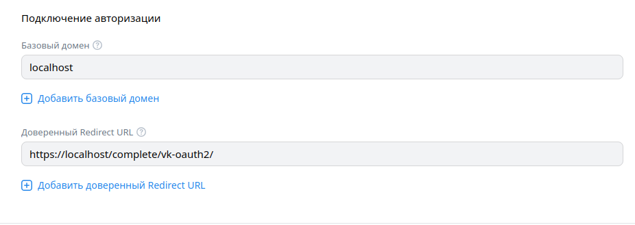
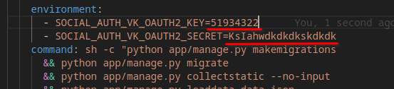

# PlacesRemember

### Starting instruction:
- create the vk-auth app with params

- replace the mock-data to the your data in docker-compose.yml

- run "docker-compose up"
- wait for it to be ready

### Urls:
- App Url: https://localhost/accounts
- Admin Url: https://localhost/admin

### Admin login details:
- login: root
- password: root

### About admin:
Admin haven't account in the app (because it requires authorization via vk).

### About unit-tests:
Although unit tests are run on push, they were not written, because they should test individual methods, and not depend on the implementation => I did not understand what exactly I need to test

